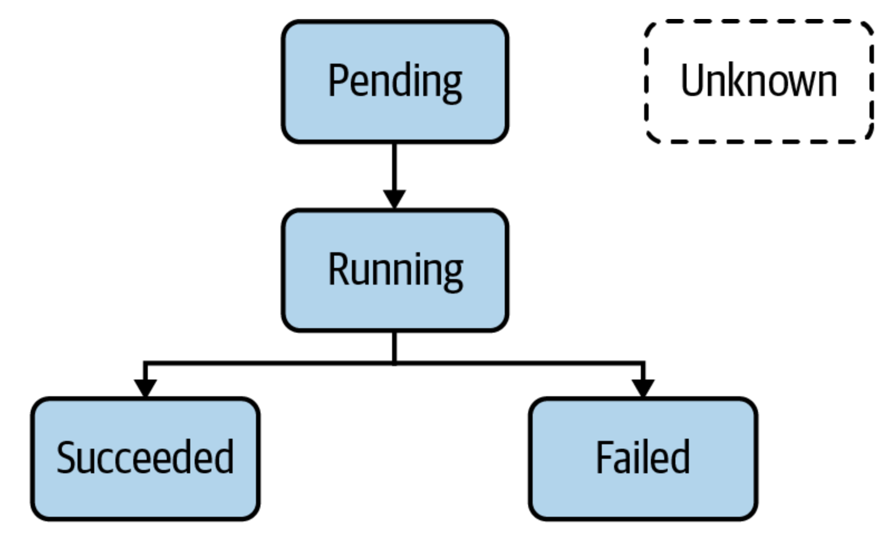

# Certified Kubernetes Application Developer  

---

[Previous](00_main.md) | [Next](02_configuration.md)

## Primitive
A **primitive** in Kubernetes is a basic building block in the whole architecture used for creating and operating an
application in the platform. The Kubernetes primitive is the equivalent of the class in object-oriented programming 
languages: it works as a blueprint of a real-world functionality. Whenever Kubernetes creates an object from the primitive,
it creates the equivalent of an OOP object instance.  
Every Kubernetes primitive follows a general structure:  
 - **API version**: the version of the Kubernetes API structure, similar to the XML schemas, used for validate the correctness of the data
 - **Kind**: the type of the primitive
 - **Metadata**: the information of the object in a higher-level format 
 - **Spec**: the specifications wanted to be reached after the creation
 - **Status**: the actual status defined currently in an object, that the Kubernetes controllers try to edit in order to make it 
equals to the specification

  

Every Kubernetes object contains a **system-generated UID** in order to been distinguished from the other entities of the system.


## Pods
The most important primitive in the whole Kubernetes API set is the **Pod**. A Pod permits to run a containerized application
that can consumes other services (like persistent storage, configuration data, and so on) using other mediator object.  
A container permits to package an application in a single unit of software, including its runtime environment and a
configuration. The unit of software usually includes the OS, the application source code (or the binary), the needed
dependencies and other system tools. Its main goal is to decouple the runtime environment from the application, making
the application portable and installable in every environment.  
The process of construct a bundle of the application in a container is defined as **containerization**. This process works
based on instructions defined in a particular file, called **Dockerfile**. The Dockerfile explicitly define what mst happens
when the software is built, generating a particular result named **image**. The image is usually published in a **registry**
for consumption by other stakeholders.


So, the Dockerfile is a blueprint of how the software should be built, the image is the artifact produced by the process
and the container is an running instance of the image.  
The Pod definition needs to refers to an existing image for every container. Before creating the Pod object, the container
runtime engine will check if the image already exists locally. If the image does not exists yet, the engine will download
it frm the container image registry. As soon as the image exists on the node, the container is instantiated and run.


## Pod life cycle
Because Kubernetes is an engine with asynchronous control loops, it is possible that the status of the Pod doesn’t show
a Running status right away when listing the Pods. It usually takes a couple of seconds to retrieve the image and effectively
start the container.



The accepted phases are:
- **Pending**: The Pod has been accepted by the Kubernetes system, but one or more of the container images has not been created.
- **Running**: At least one container is still running, or is in the process of starting or restarting.
- **Succeded**: All containers in the Pod terminated successfully.
- **Failed**: Containers in the Pod terminated, as least one failed with an error.
- **Unknown**: The state of Pod could not be retrieved.


## Configure a pod
In order to expose a way to make application runtime behavior configurable, the **environment variables** are a common option
to provide this setting. For doing so, the section `env` of a container must be updated with needed parameters.
Every environment variable consists of a key-value pair, represented respectively by the attributes name and value. It’s
recommended to follow the Kubernetes standard of using upper-case letters and the underscore character (_) to separate words.
```yaml
apiVersion: v1
kind: Pod
metadata:
  name: app-name
spec:
  containers:
  - image: somedomain/some-image:1.0.0
    name: somepod
    env:
    - name: AN_ENV_PARAMETER
      value: 'abcd'
    - name: ANOTHER_ENV_PARAMETER
      value: '1234'
```


### Namespace
**Namespaces** are an API construct used to avoid naming collisions and represent a scope for object names. A good use case
for namespaces is to isolate the objects by team or responsibility.  
There exists a `default` namespace hosts object that haven’t been assigned to an explicit namespace and a set of namespaces
that starts with the prefix `kube-`. Those are not considered as end user-namespaces (they have been created by the Kubernetes
system), therefore must not be used for development purpose.


## Kubectl
**Kubectl** is the primary tool used to interact with the Kubernetes cluster from the command line. A `kubectl` execution
consists of a command, a resource type, a resource name and some optional flags:

```
kubectl [command] [type] [name] [flags]
```

where:
- `command`: specifies the operation planned to run
- `type`: specifies the resource type on which the command is required to run
- `name`: specifies the name of the resource, defined in `metadata.name` in the YAML representation
- `flags`: specifies zero or more command line flags to describe additional configuration behavior.

The object in a Kubernetes cluster can be defined in two different ways:
- **imperative** approach: this does not require a manifest definition and must be executed with `kubectl run` or `kubectl create` command.
   ```
   kubectl run podname --image=some/image --restart=Never --port=80
   ```
- **declarative** approach: this creates objects from a manifest file using the `kubectl create` or `kubectl apply` command.
   ```
   kubectl create -f pod.yaml
   ```
- **hybrid** approach: this permits to creates object with both the methods:
   ```
   kubectl run podname --image=some/image --restart=Never --port=80 -o yaml > pod.yaml
  
   *some update on pod.yaml after creation...*
  
   kubectl create -f pod.yaml
   ```
  

---
## Commands 
### Delete an object 
 - Deleting a Kubernetes object by name:  
 
   ```kubectl delete pod podname```

 - Deleting a Kubernetes object by related YAML manifest:  
   
   ```kubectl delete -d pod.yaml```


### Edit an object
 - Edit a Kubernetes object by editor:  

   ```kubectl edit pod podname```

 - Edit a Kubernetes object in declarative mode:

   ```kubectl apply -f pod.yaml```

 - Replace the definition of a Kubernetes object in declarative mode:
   
   ```kubect replace -f pod.yaml```

> [!NOTE] **Difference between create and apply**  
> The `create` command instantiates a new object: try to execute it for an existing object will produce an error.
> The `apply` command is meant to update an existing object in its entirety or just incrementally. So, the provided YAML manifest 
> can be either a full definition of an object or a partial definition. If the object doesn’t exist yet, the `apply` command 
> behaves like the `create`, but the YAML manifest will need to contain a full definition of the object.


### Create a pod

 - Create a Kubernetes Pod in imperative mode:

   ```
      kubectl run podname \
      --image=pod/podimage \
      --restart=Never \
      --port=5701 \
      --env="SOMEENV=someval" \
      --labels="app=podname,env=prod"
   ```

  - Create a Kubernetes Pod in declarative mode:

   ```kubectl create -f pod.yaml```

   ```yaml 
   apiVersion: v1
   kind: Pod
   metadata:
     name: podname
     labels:
       app: podname
       env: prod
   spec:
     containers:
     - env:
       - name: SOMEENV
         value: somevalue
       image: pod/podimage
       name: podname
       ports:
       - containerPort: 5701
     restartPolicy: Never
   ```
   
Parameters:

| Flag     | Meaning                                                     |
|----------|-------------------------------------------------------------|
| `image`  | the image to run for generating the container               |
| `port`   | the port that this container exposes                        |
| `rm`     | deletes the pod after the command in the container finishes |
| `env`    | the environment variables to set in the container           |
| `labels` | the list of labels separated by a comma                     |


### Delete a pod
- Delete a Kubernetes Pod in imperative mode:

   ```kubectl delete pod podname```

 - Delete a Kubernetes Pod in declarative mode:

   ```kubectl delete -f pod.yaml```

> [!NOTE] **Pod deletion**  
> Kubernetes tries to delete a Pod gracefully, meaning that the Pod will try to finish active requests to the Pod in order to
> avoid unnecessary disruption to the end user. A graceful deletion operation can take anywhere from 5-30 seconds.
> For a violent deletion of the pod, it is necessary to append the flags `--grace-period=0 --force`


### Inspect a pod

 - Retrieve main info for all pods  
   
   ```kubectl get pods```

 - Retrieve main infor for queried pod  

   ```kubectl get pods podname```

 - Inspect pod detail

   ```kubectl describe pods podname```

 - Get the pod logs 

   ```kubectl logs podname [-f]```

> [!NOTE] **Logs lifecycle**  
> After the container restart, it is not possible to have access to the logs of the previous container anymore: the `logs` 
> command only renders the logs for the current container. However, it is still possible to get back the logs of the
> previous container by adding the `-p` command line option.


### Command execution on pod start

 - Executing commands at startup in imperative mode:

   ```
   kubectl run podname \
      --images=somedomain/some-image -o yaml 
      --restart=Never > pod.yaml \
      -- /bin/sh -c "while true; echo "Hello"; sleep 10; done"
   ```

 - Executing commands at startup in declarative mode with `args`:

   ```yaml
   apiVersion: v1
   kind: Pod
   metadata:
      name: podname
   spec:
      containers:
         - args:
              - /bin/sh
              - -c
              - while true; echo "Hello"; sleep 10; done
           image: somedomain/some-image
           name: podname
      restartPolicy: Never
   ```

 - Executing commands at startup in declarative mode with `command`:

   ```yaml
   apiVersion: v1
   kind: Pod
   metadata:
     name: podname
   spec:
     containers:
     - command: ["/bin/sh"]
       args: ["-c", "while true; echo "Hello"; sleep 10; done"]
       image: somedomain/some-image
       name: podname
     restartPolicy: Never
   ```

> [!NOTE] **Entrypoint and command**  
> Many container images already define an `ENTRYPOINT` or `CMD` instruction. The command assigned to the instruction is
> automatically executed as part of the container startup process. In a Pod definition, it can be either redefined
> the image `ENTRYPOINT` and `CMD` instructions or assign a command to execute for the container (if it hasn't been specified 
> by the image). The `command` attribute overrides the image’s `ENTRYPOINT` instruction and the `args` attribute replaces the
> `CMD` instruction of an image.


### Create namespace 

 - Create new Kubernetes namespace:

   ```create namespace namespace-name```

 - Get list of Kubernetes namespaces:

   ```kubectl get namespaces```

> [!NOTE] **Entrypoint and command**  
> Once the namespace is in place, you can create objects within it with the command line option `--namespace` or its 
> short-form `-n`.
> ```
> kubectl run podname --image=somedomain/some-image --restart=Never -n namespace-name
> kubectl get pods -n namespace-name
> ```


---

[Previous](00_main.md) | [Next](02_configuration.md)