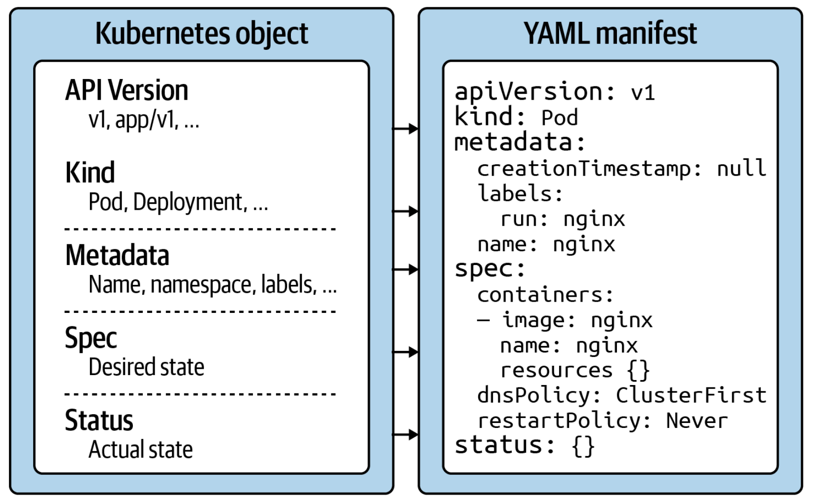

# Certified Kubernetes Application Developer  

---

## Core Concepts
A **primitive** in Kubernetes is a basic building block in the whole architecture used for creating and operating an
application in the platform. The Kubernetes primitive is the equivalent of the class in object-oriented programming 
languages: it works as a blueprint of a real-world functionality. Whenever Kubernetes creates an object from the primitive,
it creates the equivalent of an OOP object instance.  
Every Kubernetes primitive follows a general structure:  
 - **API version**: the version of the Kubernetes API structure, similar to the XML schemas, used for validate the correctness of the data
 - **Kind**: the type of the primitive
 - **Metadata**: the information of the object in a higher-level format 
 - **Spec**: the specifications wanted to be reached after the creation
 - **Status**: the actual status defined currently in an object, that the Kubernetes controllers try to edit in order to make it 
equals to the specification

  

Every Kubernetes object contains a **system-generated UID** in order to been distinguished from the other entities of the system.

### Kubectl
Kubectl is the primary tool used to interact with the Kubernetes cluster from the command line. A `kubectl` execution
consists of a command, a resource type, a resource name and some optional flags:  

```
kubectl [command] [type] [name] [flags]
```

where:
 - `command`: specifies the operation planned to run
 - `type`: specifies the resource type on which the command is required to run
 - `name`: specifies the name of the resource, defined in `metadata.name` in the YAML representation
 - `flags`: specifies zero or more command line flags to describe additional configuration behavior.

The object in a Kubernetes cluster can be defined in two different ways:
 - **imperative** approach: this does not require a manifest definition and must be executed with `kubectl run` or `kubectl create` command.
    ```
    kubectl run podname --image=some/image --restart=Never --port=80
    ```
 - **declarative** approach: this creates objects from a manifest file using the `kubectl create` or `kubectl apply` command.
    ```
    kubectl create -f pod.yaml
    ```
 - **hybrid** approach: this permits to creates object with both the methods:
    ```
    kubectl run podname --image=some/image --restart=Never --port=80 -o yaml > pod.yaml
   
    *some update on pod.yaml after creation...*
   
    kubectl create -f pod.yaml
    ```
  
#### Delete an object 
The `kubectl` executable offers other commands for object management. For deleting a Kubernetes object, the `delete` commands
offers the options to deleting it by name:
```
kubectl delete pod podname
```
or deleting it by related YAML manifest:
```
kubectl delete -d pod.yaml
```

#### Edit an object
It is possible to edit an object from the terminal (using an edito of choice) using the `edit` command:
```
kubectl edit pod podname
```
If is required to replace the definition of an existing object in declarative mode, it can be used the `replace` command:
```
kubect replace -f pod.yaml
```

#### Difference between create ad apply
The `create` command instantiates a new object and trying to execute it for an existing object will produce an error. 
The `apply` command is meant to update an existing object in its entirety or just incrementally. So, the provided YAML manifest 
can be either a full definition of an object or a partial definition. If the object doesn’t exist yet, the `apply` command 
behaves like the `create`, but the YAML manifest will need to contain a full definition of the object:
```
kubectl apply -f pod.yaml
```


### Pods